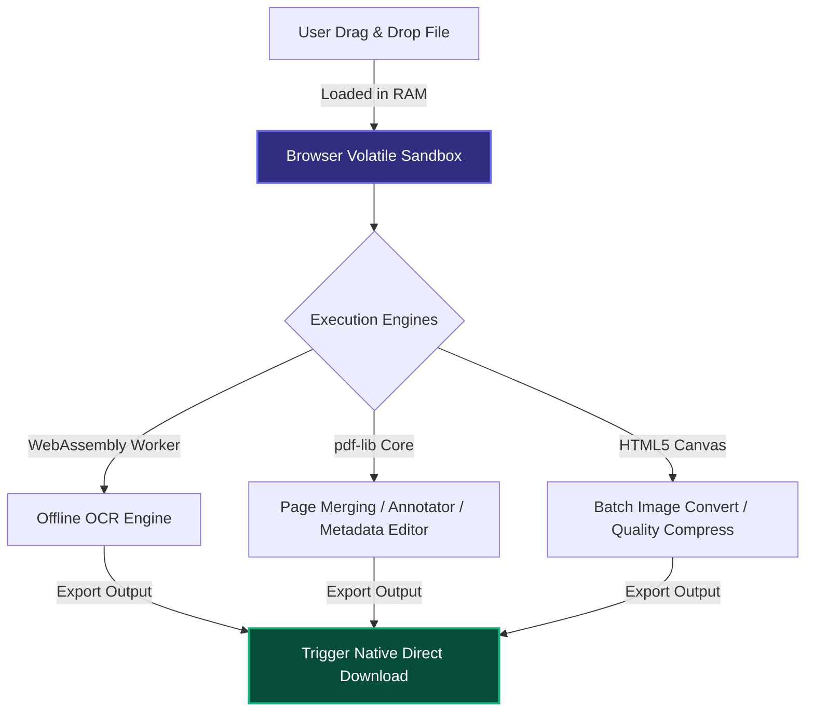

<div align="center">
  
# 🎨 ImgConvert Pro & 📄 Client-Side PDF Tools

[](https://reactjs.org/)
[](https://www.typescriptlang.org/)
[](https://vitejs.dev/)
[](https://tailwindcss.com/)
[](https://webassembly.org/)

**A powerful, premium local-first document workspace for processing images and PDFs entirely inside the browser's virtualized sandbox.**
<br />
*No files are ever uploaded to a server—100% processing in client-side RAM memory with GPU-bound canvas acceleration.*

</div>

---

## 🔒 Local Sandbox Data-Flow Architecture



---

## 🌟 Premium Features Directory

### 🖼️ Universal Batch Image Converter
* **Comprehensive Format Conversions:** Convert simultaneously between `PNG`, `JPG`, `JPEG`, `WEBP`, `AVIF`, `SVG`, `ICO`, `BMP`, `TIFF`, and `GIF`.
* **Lossless Quality Customizer:** Real-time visual compression sliders with calculated output byte indicators.
* **Canvas Border Padding:** Add aesthetic margins and custom backgrounds using color-pickers without stretching base layouts.
* **Pro Resizing & Aspect Lock:** Scale dimensions via custom pixels or default platforms proportions.
* **Transparency (Alpha Channels):** Preserve background transparenties or fill with custom highlights.
* **Instant ZIP Compilation:** Download entire batch operations instantly via local-first ZIP archives.

### 📄 Advanced PDF Tools Suite
* **Interactive PDF Annotator:** Draw, write, erase, highlight, and adjust stroke vectors on an interactive canvas with undo/redo stacks.
* **Visual Page Organizer:** Rearrange pages, delete pages, rotate single pages visually with an interactive zoom viewer.
* **WASM Offline OCR Engine:** Extract selectable text locally from flat scans using Tesseract Web Worker threads.
* **Calculated PDF Splitter:** Partition documents by specific ranges, extract custom individual lists, or split every N pages.
* **Precise Rotator & Cropper:** Align upside-down scans or crop layout margins dynamically.
* **Dynamic Watermarker:** Stamp custom opacity centered text or tiled repeating copyright patterns utilizing native embedded standard fonts.
* **Adaptive Page Numbers:** Stamp formatted labels (e.g., "Page 1 of 5", "1/5") across 4 distinct margin coordinates.
* **Metadata Editor:** Add or modify PDF indexing properties (Title, Author, Subject, Keywords, Creator, Producer).
* **Grayscale Black & White Converter:** Convert documents to grayscale locally to save ink and improve high-contrast readability.
* **Forms & Widget Flattener:** Flatten editable fields and visual annotations to lock down vector layouts.
* **Office-to-PDF Converter:** Convert documents, text files, and spreadsheets locally.
* **PDF to High-Res Images & Images to PDF:** Dynamic bi-directional conversion pipelines.

---

## 🌐 Browser Support & Performance Matrix

| Browser | WebAssembly (WASM) | HTML5 Canvas GPU | Threading (Web Workers) | Recommended Limit |
| :--- | :---: | :---: | :---: | :---: |
| **Google Chrome** | 🟢 Native (Fast) | 🟢 Accelerated | 🟢 Multi-threaded | 100+ files / 500MB |
| **Mozilla Firefox** | 🟢 Native (Fast) | 🟢 Accelerated | 🟢 Multi-threaded | 80+ files / 400MB |
| **Apple Safari** | 🟢 Native (Stable) | 🟢 Accelerated | 🟢 Native Workers | 50+ files / 300MB |
| **Microsoft Edge** | 🟢 Native (Fast) | 🟢 Accelerated | 🟢 Multi-threaded | 100+ files / 500MB |
| **Brave Browser** | 🟢 Native (Fast) | 🟢 Accelerated | 🟢 Multi-threaded | 100+ files / 500MB |

---

## 📖 Local OCR Dictionary Catalog

Our WASM-powered Optical Character Recognition engine operates fully offline by loading optimized dictionary models directly inside browser threads. Supported language packs include:

* **English (`eng`)**
* **Spanish (`spa`)**
* **French (`fra`)**
* **German (`deu`)**
* **Italian (`ita`)**
* **Portuguese (`por`)**
* **Russian (`rus`)**
* **Chinese (`chi_sim` / `chi_tra`)**
* **Japanese (`jpn`)**
* **Korean (`kor`)**

---

## 🎨 Custom Design System & Design Tokens

ImgConvert Pro is styled utilizing a customized, highly premium Tailwind CSS layout containing glassmorphic utilities and dark-theme configurations:

```javascript
// tailwind.config.js
module.exports = {
  theme: {
    extend: {
      colors: {
        surface: {
          50: '#f8fafc',
          900: '#0f172a',
          950: '#070a13' // Custom deep canvas base token
        },
        primary: {
          500: '#6366f1', // Vibrant Violet Indigo
          600: '#4f46e5'
        }
      }
    }
  }
}
```

---

## 📂 Visual Workspace Structure
```text
Image-Converter-website-main/
├── public/                 # Static assets, fonts, cmaps, and local locales
├── src/
│   ├── components/         # Reusable UI widgets (Navbar, Footer, Card, Button)
│   ├── layouts/            # Main site structure wrapper (MainLayout)
│   ├── pages/              # Main app view sandboxes
│   │   ├── Home.tsx        # Hero Router Landing page
│   │   ├── Converter.tsx   # Batch Image converting engine
│   │   ├── PdfTools.tsx    # PDF Suite & interactive editor
│   │   ├── Features.tsx    # Feature breakdown & compliance grids
│   │   ├── Blog.tsx        # Blog center & local CMS modal
│   │   └── About.tsx       # About page
│   ├── App.tsx             # Route registry
│   ├── index.css           # Global layout variables & typography
│   └── main.tsx            # React virtual DOM bootstrap
├── package.json            # System scripts & dependencies
├── tailwind.config.js      # Custom theme color tokens
└── vite.config.ts          # Vite bundler parameters
```

---

## 🚀 Running Locally

### Prerequisites
Make sure you have [Node.js](https://nodejs.org/) (version 18+ recommended) installed.

### Installation
1. **Clone the repository:**
   ```bash
   git clone https://github.com/Subhan-Haider/ImgConvert-Pro.git
   cd Image-Converter-website-main
   ```

2. **Install node dependencies:**
   ```bash
   npm install
   ```

3. **Start the local hot-reload dev-server:**
   ```bash
   npm run dev
   ```
   *The application will boot at `http://localhost:5173` (or `http://localhost:5175`).*

4. **Verify TypeScript & compile a production-ready package:**
   ```bash
   npm run build
   ```
   *The optimized static assets will be compiled directly in the `dist` directory.*

---

## 📝 License & Copyright

**Copyright (c) 2026 Subhan Haider. All Rights Reserved.**

This is proprietary software. You may view and fork this repository for personal evaluation, but commercial use, unauthorized distribution, or creating a competing product from this source code is strictly prohibited. See the [LICENSE](LICENSE) file for more details.
